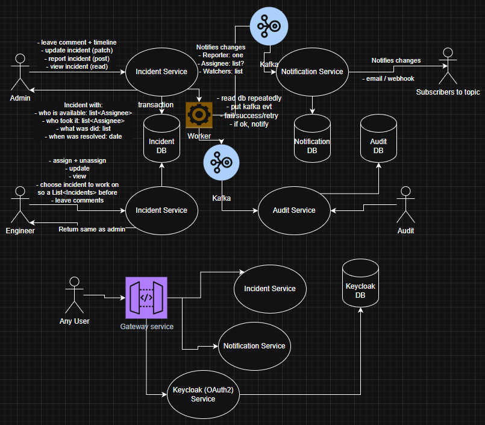

# IncidentHub
Proof of concept incident management system:
- report, assign and resolve production-like incidents
- track status changes, and keep an auditable timeline
- async processing via messaging and a production-like delivery workflow  

# Why this project
I built IncidentHub as a portfolio project for Backend/FullStack roles to demonstrate:
- Clean Spring Boot service design (controllers/services/repositories)
- Persistence with PostgreSQL
- Asynchronous workflows via messaging with Kafka
- Local environment containerization with Docker
- CI/CD pipelines with GitHub Actions
- A minimal Frontend UI for incident browsing with React

# GitHub workflow
Inside requirements.md, there are core ideas I implement and push inside GitHub repository:
- I make commits clearly and concise
- I use the feature branching strategy
- I pull requests to the main branch

# How to run
[//]: # (TODO)